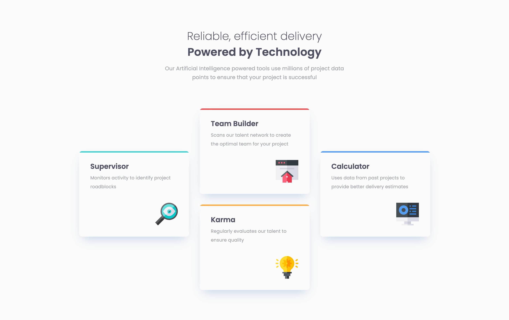
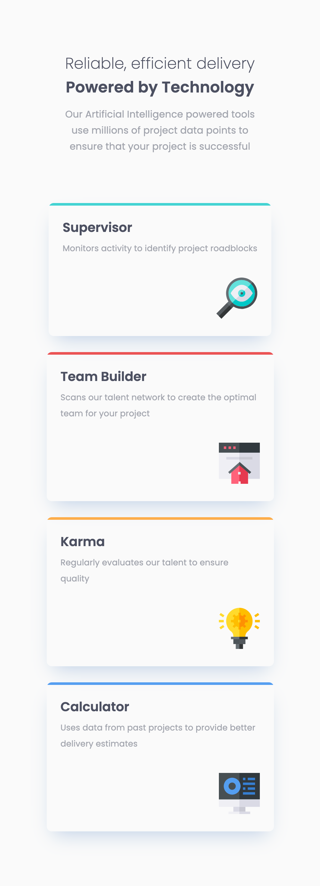

# Frontend Mentor - Four card feature section solution

This is a solution to the [Four card feature section challenge on Frontend Mentor](https://www.frontendmentor.io/challenges/four-card-feature-section-weK1eFYK). Frontend Mentor challenges help you improve your coding skills by building realistic projects. 

## Table of contents

- [Overview](#overview)
  - [The challenge](#the-challenge)
  - [Screenshot](#screenshot)
  - [Links](#links)
- [My process](#my-process)
  - [Built with](#built-with)
  - [What I learned](#what-i-learned)
- [Author](#author)

## Overview

### The challenge

Users should be able to:

- View the optimal layout for the site depending on their device's screen size

### Screenshot


**Desktop Version**


**Mobile Version**

### Links

- Solution URL: [Solution Url](https://github.com/anhoang241998/Four-card-feature-section)
- Live Site URL: [Live site](https://anhoang241998.github.io/Four-card-feature-section/)

### Built with

- Semantic HTML5 markup
- CSS custom properties
- Flexbox
- CSS Grid
- Mobile-first workflow

## My Process

### What I learned

- In this project I learned how to combine CSS Flexbox, Grid and Position to achieve the required design.
- Moreover I also learned the mobile first design.

```css
  .container-cards {
    display: flex;
    flex-wrap: wrap;
    justify-content: center;
    max-width: 111rem;
    gap: 3rem;
  }
  .card {
    width: 30rem;
    box-sizing: border-box;
    display: flex;
    flex-direction: column;
    justify-content: center;
    padding: 3.2rem;
  }
  .card-push {
    transform: translateY(50%);
  }
```

## Author

- Faceboook - [Nguyen Hoang An Facebook](https://www.facebook.com/an.nguyenhoang.10)
- Frontend Mentor - [@anhoang241998](https://www.frontendmentor.io/profile/anhoang241998)
